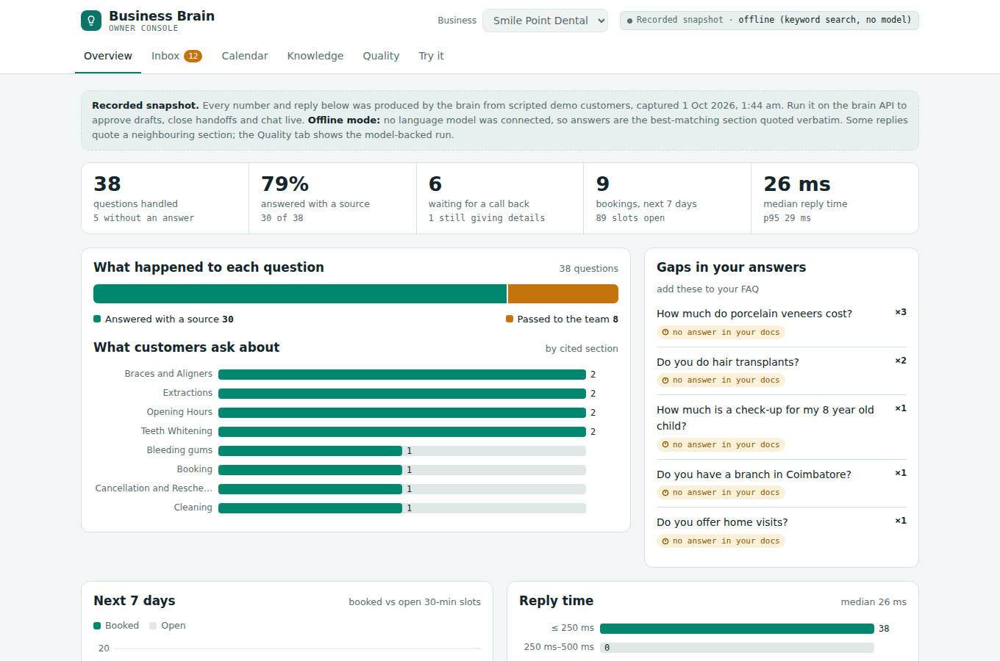
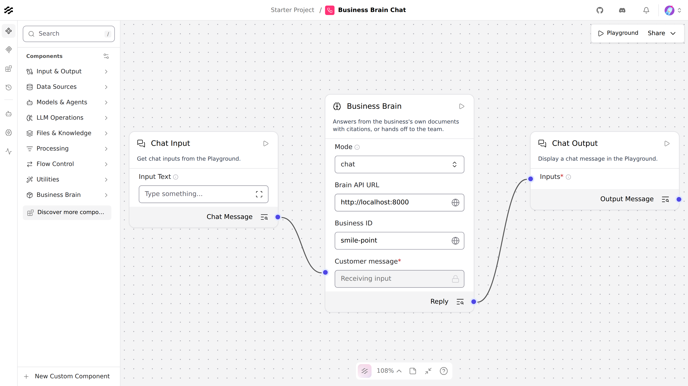

# Business Brain (Project 4)

The shared intelligence that the voice agent, WhatsApp agent and lead engine all call.

## What it does
- **Ingest** markdown, text, PDF files and URLs → chunks → Postgres (+ pgvector embeddings when a key is set).
- **Re-sync**: unchanged sources are skipped (content hash); changed ones are rebuilt.
- **Hybrid retrieval**: full-text + vector search, fused with reciprocal rank fusion.
- **Grounded answers**: every sentence cited; an answer with no valid citation is rejected.
- **Human handoff**: when it can't answer (or the customer asks for a person), it says it will connect them
  with the team, collects name + phone, and drafts an email to the owner. It never asks for details twice.
- **Calendar**: availability from opening hours, book, reschedule (atomic), cancel. Double booking is
  refused by a Postgres exclusion constraint, not just app code.
- **Email drafts**: grounded replies to customer emails and handoff alerts to the owner. Drafts only;
  a human approves and sends.
- **Tenant isolation**: every row and every query is scoped by `business_id`; evals check for leaks.

## Live site (Netlify)
The console and the API run on Netlify, backed by Supabase Postgres + pgvector. Visitors chat with the brain;
other agents connect over MCP (`/api/mcp`) or REST (`/api/*`). Setup: [DEPLOY.md](DEPLOY.md).

| Tab | |
|---|---|
| Try it | Live chat with any tenant: the fictional Chennai clinic, or the Austin practices the lead engine built demos for (labelled as unofficial demos) |
| Compare | Head-to-head against "paste every document into the prompt": accuracy, made-up answers, cost per 1,000 questions, reply time, cost as the knowledge base grows ([benchmark/run.py](benchmark/run.py)) |
| Overview, Inbox, Calendar, Knowledge, Quality | The owner console; inbox actions and full phone numbers need the owner key |
| Connect an agent | MCP config, REST examples, Langflow URL |

The serving path is a TypeScript port of the Python brain (`netlify/lib/`): same prompt, same citation gate,
same handoff state machine. `web/test-api.mjs` runs 15 contract checks against local or live.

## Owner console
A dashboard served by the brain itself at **`/dashboard`** ([`dashboard/`](dashboard/index.html)). Live, it reads the
database and lets the owner approve or discard email drafts, mark handoffs as called back, and chat with the
brain. `python -m dashboard.export` freezes it with one business's data into `dashboard/snapshot.html`, a static
page for sharing (actions and live chat are disabled there).

| Tab | What the owner sees |
|---|---|
| Overview | Questions handled, % answered with a source, who's waiting for a call back, bookings, reply time; what customers ask about; questions with no answer in the docs (FAQ gaps); recent questions with the brain's actual reply |
| Inbox | Handoffs (name, number, question) and email drafts awaiting approval |
| Calendar | Next 7 days of bookings and open slots |
| Knowledge | Ingested documents, sections, how many are embedded, last sync |
| Quality | The eval scorecard and every case, filterable to failures |
| Try it | Chat with the brain on that business's documents |

`python -m brain.demo_traffic` replays 30 scripted customers and 9 bookings through the real system so the console
has data to show; every reply in it is the brain's own output.



## Langflow
A custom **Business Brain** component and an importable flow live in [`langflow/`](langflow/README.md).
The owner edits the flow visually; the API keeps the guarantees.



## Run
```bash
python -m venv .venv && .venv/bin/pip install -r requirements.txt
cp .env.example .env              # paste NVIDIA_API_KEY
.venv/bin/python -m brain.seed    # sample clinic + salon
.venv/bin/python -m evals.run     # answer-quality evals (51 cases)
.venv/bin/python -m pytest -q     # handoff, calendar, drafts, phones, dashboard (26 tests)
.venv/bin/uvicorn brain.api:app --port 8000   # console at http://localhost:8000/dashboard
```

## API
| Endpoint | Purpose |
|---|---|
| `POST /ask` | Stateless cited answer or "I don't know" |
| `POST /chat` | Stateful: answer, or hand off and collect name + phone |
| `GET /calendar/slots?business_id=&day=&duration_min=` | Free slots |
| `POST /calendar/book` · `/reschedule` · `/cancel` | Appointments (409 if slot taken) |
| `POST /drafts/reply` · `GET /drafts` | Email drafts for human approval |
| `POST /ingest` | Add or re-sync sources |

## Providers
First key found wins: `NVIDIA_API_KEY` → `GEMINI_API_KEY` → `ANTHROPIC_API_KEY`. No key = keyword search +
extractive answers (the offline baseline). NVIDIA defaults: `nvidia/nemotron-3-super-120b-a12b` (thinking off) for chat,
`nvidia/llama-nemotron-embed-vl-1b-v2` (truncated to 1024-d) for embeddings. The previous defaults
(`meta/llama-3.3-70b-instruct`, `nvidia/nv-embedqa-e5-v5`) reached end of life in August 2026.

## Sample data
Smile Point Dental is **fictional**. Its prices sit inside publicly reported Chennai ranges (2025–26):
consultation Rs 99–500, scaling Rs 1,499–3,000, root canal Rs 3,000–8,000, implants Rs 25,000–60,000,
aligners Rs 50,000–2,00,000. FAQ topics follow the most common patient questions (anxiety, pregnancy,
aftercare, kids' first visit).

## Eval results
| Mode | Answerable | Tanglish | Abstain | Cross-tenant | Injection | Total |
|---|---|---|---|---|---|---|
| Offline (no key) | 30/36 | 1/3 | 6/6 | 2/2 | 4/4 | 43/51 (84%) |
| NVIDIA (hybrid) | 36/36 | 2/3 | 6/6 | 2/2 | 4/4 | 50/51 (98%) |

Offline abstain/injection passes are cheap: there is no model to trick. The NVIDIA row is the real test.
NVIDIA latency: p50 1.3 s, p95 2.8 s. The one miss is `x02` ("Clinic enga irukku?"): the embedder ranks the
Languages chunk above Location, so it is a retrieval miss. `MIN_VECTOR_SIM` can't fix it: similarities for
answerable (min 0.21) and unanswerable (max 0.34) questions overlap, so the threshold stays at 0.30.

## Next
1. Fix Tanglish retrieval (x02): transliterate/translate the query before embedding, or add Tanglish aliases to FAQ headings
2. Langfuse tracing: cost + latency per answer
3. Weekly report email from the console's data (FAQ gaps are already computed)
4. Google Calendar + Gmail providers behind the same functions; MCP server wrapper
6. Move DB to Supabase
